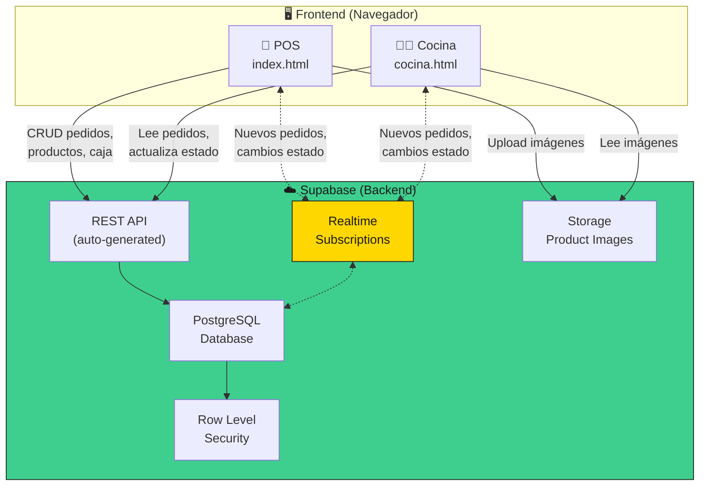
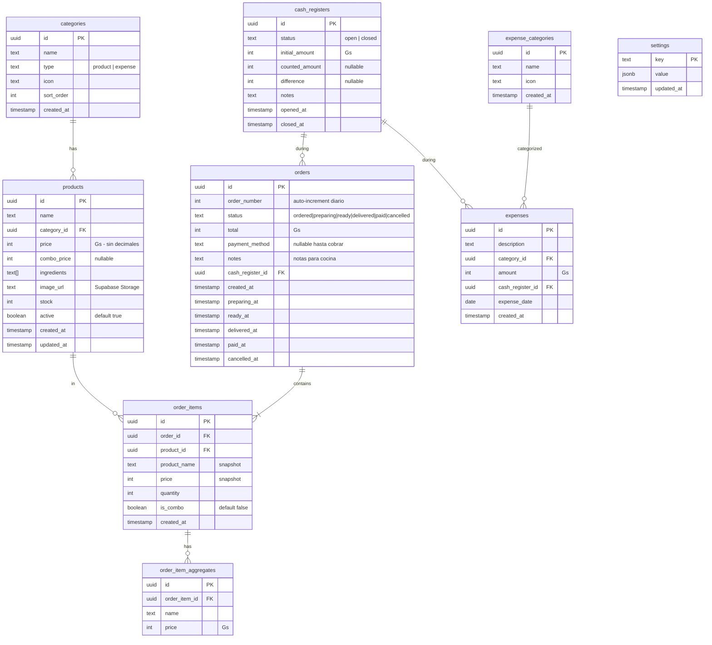
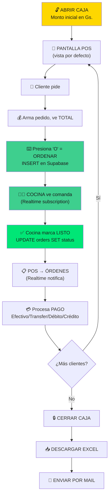

# 🎮 Sistema de Gestión Burgame — Plan de Implementación v4 (FINAL)

> *"Lo único que no es un juego, es la comida"*

---

## Resumen

Sistema de gestión para **Burgame** (hamburguesería gamer, Paraguay). Backend con **Supabase** (PostgreSQL + Realtime + Storage). Flujo: Abrir caja → POS → Ordenar (tecla "O") → Cocina recibe → Entregar → Cobrar → Cerrar caja → Excel → Email.

---

## Arquitectura con Supabase



### ¿Por qué Supabase?

| Característica | Beneficio para Burgame |
|---------------|----------------------|
| **PostgreSQL** | Base de datos relacional robusta, gratis hasta 500MB |
| **Realtime** | POS y Cocina sincronizados al instante sin configuración extra |
| **Storage** | Subir fotos de productos directamente desde el sistema |
| **API REST auto** | No hay que escribir backend, el frontend habla directo con la DB |
| **RLS** | Seguridad a nivel de fila — protege los datos |
| **Free tier** | Perfecto para un solo local |

> [!NOTE]
> **Región recomendada**: `sa-east-1` (São Paulo) — la más cercana a Paraguay para menor latencia.

---

## Database Schema



> [!IMPORTANT]
> **Todos los montos son enteros** (Guaraníes no tienen centavos). Se almacenan como `integer`, no `numeric` ni `float`. Esto evita errores de redondeo.

---

## Migración SQL Principal

```sql
-- ============================================
-- BURGAME DATABASE SCHEMA
-- ============================================

-- 1. CATEGORIES (product & expense)
CREATE TABLE categories (
    id UUID PRIMARY KEY DEFAULT gen_random_uuid(),
    name TEXT NOT NULL,
    type TEXT NOT NULL CHECK (type IN ('product', 'expense')),
    icon TEXT,
    sort_order INTEGER DEFAULT 0,
    created_at TIMESTAMPTZ DEFAULT now()
);

-- 2. PRODUCTS
CREATE TABLE products (
    id UUID PRIMARY KEY DEFAULT gen_random_uuid(),
    name TEXT NOT NULL,
    category_id UUID REFERENCES categories(id),
    price INTEGER NOT NULL, -- Gs. sin decimales
    combo_price INTEGER,    -- Gs. precio combo (nullable)
    ingredients TEXT[] DEFAULT '{}',
    image_url TEXT,          -- URL de Supabase Storage
    stock INTEGER DEFAULT 0,
    active BOOLEAN DEFAULT true,
    created_at TIMESTAMPTZ DEFAULT now(),
    updated_at TIMESTAMPTZ DEFAULT now()
);

-- 3. CASH REGISTERS
CREATE TABLE cash_registers (
    id UUID PRIMARY KEY DEFAULT gen_random_uuid(),
    status TEXT NOT NULL DEFAULT 'open' CHECK (status IN ('open', 'closed')),
    initial_amount INTEGER NOT NULL DEFAULT 0,
    counted_amount INTEGER,
    difference INTEGER,
    notes TEXT,
    opened_at TIMESTAMPTZ DEFAULT now(),
    closed_at TIMESTAMPTZ
);

-- 4. ORDERS
CREATE TABLE orders (
    id UUID PRIMARY KEY DEFAULT gen_random_uuid(),
    order_number INTEGER NOT NULL,
    status TEXT NOT NULL DEFAULT 'ordered' 
        CHECK (status IN ('ordered','preparing','ready','delivered','paid','cancelled')),
    total INTEGER NOT NULL DEFAULT 0,
    payment_method TEXT CHECK (payment_method IN ('efectivo','transferencia','debito','credito')),
    notes TEXT,
    cash_register_id UUID REFERENCES cash_registers(id),
    created_at TIMESTAMPTZ DEFAULT now(),
    preparing_at TIMESTAMPTZ,
    ready_at TIMESTAMPTZ,
    delivered_at TIMESTAMPTZ,
    paid_at TIMESTAMPTZ,
    cancelled_at TIMESTAMPTZ
);

-- 5. ORDER ITEMS
CREATE TABLE order_items (
    id UUID PRIMARY KEY DEFAULT gen_random_uuid(),
    order_id UUID NOT NULL REFERENCES orders(id) ON DELETE CASCADE,
    product_id UUID REFERENCES products(id),
    product_name TEXT NOT NULL, -- snapshot del nombre
    price INTEGER NOT NULL,     -- snapshot del precio
    quantity INTEGER NOT NULL DEFAULT 1,
    is_combo BOOLEAN DEFAULT false,
    created_at TIMESTAMPTZ DEFAULT now()
);

-- 6. ORDER ITEM AGGREGATES (extras)
CREATE TABLE order_item_aggregates (
    id UUID PRIMARY KEY DEFAULT gen_random_uuid(),
    order_item_id UUID NOT NULL REFERENCES order_items(id) ON DELETE CASCADE,
    name TEXT NOT NULL,
    price INTEGER NOT NULL
);

-- 7. EXPENSE CATEGORIES
CREATE TABLE expense_categories (
    id UUID PRIMARY KEY DEFAULT gen_random_uuid(),
    name TEXT NOT NULL,
    icon TEXT,
    created_at TIMESTAMPTZ DEFAULT now()
);

-- 8. EXPENSES
CREATE TABLE expenses (
    id UUID PRIMARY KEY DEFAULT gen_random_uuid(),
    description TEXT NOT NULL,
    category_id UUID REFERENCES expense_categories(id),
    amount INTEGER NOT NULL,
    cash_register_id UUID REFERENCES cash_registers(id),
    expense_date DATE DEFAULT CURRENT_DATE,
    created_at TIMESTAMPTZ DEFAULT now()
);

-- 9. SETTINGS (key-value)
CREATE TABLE settings (
    key TEXT PRIMARY KEY,
    value JSONB NOT NULL DEFAULT '{}',
    updated_at TIMESTAMPTZ DEFAULT now()
);

-- ============================================
-- INDEXES
-- ============================================
CREATE INDEX idx_products_category ON products(category_id);
CREATE INDEX idx_products_active ON products(active);
CREATE INDEX idx_orders_status ON orders(status);
CREATE INDEX idx_orders_cash_register ON orders(cash_register_id);
CREATE INDEX idx_orders_created ON orders(created_at);
CREATE INDEX idx_order_items_order ON order_items(order_id);
CREATE INDEX idx_expenses_register ON expenses(cash_register_id);
CREATE INDEX idx_expenses_date ON expenses(expense_date);

-- ============================================
-- TRIGGERS
-- ============================================

-- Auto-update updated_at on products
CREATE OR REPLACE FUNCTION update_updated_at()
RETURNS TRIGGER AS $$
BEGIN
    NEW.updated_at = now();
    RETURN NEW;
END;
$$ LANGUAGE plpgsql;

CREATE TRIGGER products_updated_at
    BEFORE UPDATE ON products
    FOR EACH ROW
    EXECUTE FUNCTION update_updated_at();

-- Auto order_number (daily counter)
CREATE OR REPLACE FUNCTION generate_order_number()
RETURNS TRIGGER AS $$
BEGIN
    NEW.order_number = COALESCE(
        (SELECT MAX(order_number) + 1 
         FROM orders 
         WHERE created_at::date = CURRENT_DATE),
        1
    );
    RETURN NEW;
END;
$$ LANGUAGE plpgsql;

CREATE TRIGGER orders_auto_number
    BEFORE INSERT ON orders
    FOR EACH ROW
    EXECUTE FUNCTION generate_order_number();

-- ============================================
-- ROW LEVEL SECURITY
-- ============================================
-- Habilitamos RLS pero con policy permisiva usando anon key
-- (sistema de un solo local, no multi-tenant)

ALTER TABLE categories ENABLE ROW LEVEL SECURITY;
ALTER TABLE products ENABLE ROW LEVEL SECURITY;
ALTER TABLE orders ENABLE ROW LEVEL SECURITY;
ALTER TABLE order_items ENABLE ROW LEVEL SECURITY;
ALTER TABLE order_item_aggregates ENABLE ROW LEVEL SECURITY;
ALTER TABLE cash_registers ENABLE ROW LEVEL SECURITY;
ALTER TABLE expenses ENABLE ROW LEVEL SECURITY;
ALTER TABLE expense_categories ENABLE ROW LEVEL SECURITY;
ALTER TABLE settings ENABLE ROW LEVEL SECURITY;

-- Policies permisivas (single-tenant)
CREATE POLICY "Allow all" ON categories FOR ALL USING (true) WITH CHECK (true);
CREATE POLICY "Allow all" ON products FOR ALL USING (true) WITH CHECK (true);
CREATE POLICY "Allow all" ON orders FOR ALL USING (true) WITH CHECK (true);
CREATE POLICY "Allow all" ON order_items FOR ALL USING (true) WITH CHECK (true);
CREATE POLICY "Allow all" ON order_item_aggregates FOR ALL USING (true) WITH CHECK (true);
CREATE POLICY "Allow all" ON cash_registers FOR ALL USING (true) WITH CHECK (true);
CREATE POLICY "Allow all" ON expenses FOR ALL USING (true) WITH CHECK (true);
CREATE POLICY "Allow all" ON expense_categories FOR ALL USING (true) WITH CHECK (true);
CREATE POLICY "Allow all" ON settings FOR ALL USING (true) WITH CHECK (true);

-- ============================================
-- REALTIME (para POS ↔ Cocina)
-- ============================================
ALTER PUBLICATION supabase_realtime ADD TABLE orders;
```

---

## Supabase Realtime — Sync POS ↔ Cocina

```javascript
// js/services/realtime-service.js

// POS escucha cambios en pedidos (cocina los actualiza)
const ordersChannel = supabase
  .channel('orders-changes')
  .on('postgres_changes', 
    { event: '*', schema: 'public', table: 'orders' },
    (payload) => {
      switch (payload.eventType) {
        case 'INSERT':
          // Nuevo pedido creado (cocina lo ve aparecer)
          onNewOrder(payload.new);
          break;
        case 'UPDATE':
          // Estado cambió (ej: cocina marcó "ready")
          onOrderStatusChanged(payload.new);
          break;
      }
    }
  )
  .subscribe();
```

**Esto reemplaza BroadcastChannel**: Ahora la sincronización es vía PostgreSQL → Supabase Realtime → ambas pestañas. Funciona incluso si POS y Cocina están en **dispositivos diferentes** (ej: una tablet en la cocina).

---

## Supabase Storage — Imágenes de Productos

```javascript
// Subir imagen de producto
const { data, error } = await supabase.storage
  .from('product-images')
  .upload(`burgers/${fileName}`, file, {
    contentType: 'image/jpeg',
    upsert: true
  });

// Obtener URL pública
const { data: { publicUrl } } = supabase.storage
  .from('product-images')
  .getPublicUrl(`burgers/${fileName}`);
```

**Bucket**: `product-images` (público, solo lectura para anon).

Las fotos existentes (`arcade_classic.jpeg`, etc.) se subirán como parte del seed.

---

## Flujo de Trabajo (sin cambios)



---

## Cambios en Frontend (vs v3)

### Nuevo: `js/supabase-client.js`
Inicialización del SDK de Supabase con la URL y anon key del proyecto.

```javascript
import { createClient } from 'https://esm.sh/@supabase/supabase-js@2';

const SUPABASE_URL = 'https://xxxxx.supabase.co';
const SUPABASE_ANON_KEY = 'eyJ...';

export const supabase = createClient(SUPABASE_URL, SUPABASE_ANON_KEY);
```

> [!NOTE]
> La **anon key** es una clave pública (publishable), segura para el frontend. La protección real viene de las RLS policies en PostgreSQL.

### Servicios Refactorizados

Todos los servicios cambian de IndexedDB a Supabase:

| Servicio | Antes (IndexedDB) | Ahora (Supabase) |
|----------|-------------------|-------------------|
| product-service | `db.get('products')` | `supabase.from('products').select()` |
| order-service | `db.put('orders')` | `supabase.from('orders').insert()` |
| cash-service | `db.get('cash_registers')` | `supabase.from('cash_registers').select()` |
| expense-service | `db.get('expenses')` | `supabase.from('expenses').insert()` |
| **sync-service** | `BroadcastChannel` | `supabase.channel().subscribe()` |

### Nuevo: `js/services/storage-service.js`
Upload/download de imágenes de productos desde Supabase Storage.

### Se elimina
- `js/database.js` (IndexedDB) → ya no es necesario
- `data/seed.js` → el seed se hace via SQL migration

---

## Estructura de Archivos Actualizada

```
G:\Sistema BG\
├── index.html                     ← POS (cajero)
├── cocina.html                    ← Cocina (KDS)
├── BurgameLogoTrazoAmarillo.png
├── banner.png
├── menu.jpg
├── css/
│   ├── variables.css
│   ├── reset.css
│   ├── components.css
│   ├── layout.css
│   ├── animations.css
│   ├── cocina.css
│   └── pages/
│       ├── dashboard.css
│       ├── ventas.css
│       ├── ordenes.css
│       ├── menu.css
│       ├── caja.css
│       ├── gastos.css
│       ├── reportes.css
│       └── ajustes.css
├── js/
│   ├── app.js                     ← Init POS
│   ├── cocina-app.js              ← Init Cocina
│   ├── router.js                  ← Hash router
│   ├── supabase-client.js         ← 🆕 Supabase SDK init
│   ├── services/
│   │   ├── product-service.js     ← Supabase CRUD
│   │   ├── order-service.js       ← Supabase + Realtime
│   │   ├── cash-service.js        ← Supabase
│   │   ├── expense-service.js     ← Supabase
│   │   ├── report-service.js      ← Supabase queries
│   │   ├── storage-service.js     ← 🆕 Supabase Storage
│   │   └── realtime-service.js    ← 🆕 Reemplaza sync-service
│   ├── pages/
│   │   ├── dashboard.js
│   │   ├── ventas.js              ← POS con tecla "O"
│   │   ├── ordenes.js             ← Procesar pagos
│   │   ├── menu.js                ← CRUD + upload imagen
│   │   ├── cocina.js              ← KDS con Realtime
│   │   ├── caja.js                ← + Excel + Mail
│   │   ├── gastos.js
│   │   ├── reportes.js
│   │   └── ajustes.js
│   └── components/
│       ├── sidebar.js
│       ├── modal.js
│       ├── toast.js
│       ├── table.js
│       ├── chart.js
│       ├── product-card.js
│       ├── order-card.js
│       ├── currency.js
│       └── excel-export.js
├── productos/                     ← Se migran a Supabase Storage
│   ├── burgers/ (7 fotos)
│   └── papas/ (1 foto)
└── assets/
    ├── placeholders/ (SVGs locales)
    ├── icons/
    └── sounds/
```

---

## Seed Data (SQL Migration)

```sql
-- ============================================
-- SEED: Categories
-- ============================================
INSERT INTO categories (name, type, icon, sort_order) VALUES
    ('Burgers', 'product', '🍔', 1),
    ('Side Quests', 'product', '🍟', 2),
    ('Ensaladas', 'product', '🥗', 3),
    ('Bebidas', 'product', '🥤', 4),
    ('Agregados', 'product', '🎯', 5);

INSERT INTO expense_categories (name, icon) VALUES
    ('Insumos', '📦'),
    ('Servicios', '⚡'),
    ('Otros', '📌');

-- ============================================
-- SEED: Products (30+ items del menú real)
-- ============================================

-- Burgers
INSERT INTO products (name, category_id, price, combo_price, ingredients, stock, active) VALUES
('Cheat Burger', (SELECT id FROM categories WHERE name='Burgers'), 25000, 40000, 
 ARRAY['Carne','Cheddar','Ketchup','Mayonesa','Cebolla Picada'], 50, true),
('Doble Cheat', (SELECT id FROM categories WHERE name='Burgers'), 35000, 50000, 
 ARRAY['Doble Carne','Cheddar','Ketchup','Mayonesa','Cebolla Picada','Pepinillos'], 50, true),
('Arcade Classic', (SELECT id FROM categories WHERE name='Burgers'), 40000, 55000, 
 ARRAY['Doble Carne','Cheddar','Tomate','Lechuga','Cebolla','Mayonesa'], 50, true),
('Trifuerza', (SELECT id FROM categories WHERE name='Burgers'), 40000, 55000, 
 ARRAY['Triple Carne','Mucho Cheddar','Ketchup','Mayonesa','Cebolla Picada'], 50, true),
('Ronin', (SELECT id FROM categories WHERE name='Burgers'), 40000, 55000, 
 ARRAY['Doble Carne','Cheddar','Mayonesa','Bacon','Huevo Frito','Cebolla Caramelizada'], 50, true),
('Yoshi', (SELECT id FROM categories WHERE name='Burgers'), 42000, 57000, 
 ARRAY['Doble Carne','Cheddar','Mayonesa','Salsa Yoshi','Lechuga','Cebolla','Pepinillos'], 50, true),
('Hadouken', (SELECT id FROM categories WHERE name='Burgers'), 45000, 60000, 
 ARRAY['Doble Carne','Cheddar','Mayonesa','Salteado Repollo y Zanahoria','Salsa Hadouken'], 50, true),
('Fatality', (SELECT id FROM categories WHERE name='Burgers'), 45000, 60000, 
 ARRAY['Doble Carne','Cheddar','Mayonesa','Sriracha','Jalapeños','Cebolla','Pepinillos'], 50, true),
('Meltman', (SELECT id FROM categories WHERE name='Burgers'), 28000, 43000, 
 ARRAY['Pan Tostado','Carne','Cheddar','Pepinillos','Salsa Meltman'], 50, true),
('Roquefortnite', (SELECT id FROM categories WHERE name='Burgers'), 40000, 55000, 
 ARRAY['Doble Carne','Cheddar','Mayonesa','Salsa Roquefortnite','Cebolla Caramelizada','Ketchup','Bacon'], 50, true),
('Bowser', (SELECT id FROM categories WHERE name='Burgers'), 40000, 55000, 
 ARRAY['Doble Carne','Cheddar','BBQ','Cebolla Caramelizada','Bacon'], 50, false);

-- Ensaladas
INSERT INTO products (name, category_id, price, combo_price, ingredients, stock, active) VALUES
('Zelda', (SELECT id FROM categories WHERE name='Ensaladas'), 50000, 50000, 
 ARRAY['Doble Carne','Cheddar','Tomate','Lechuga','Cebolla','Pepinillos','Bacon','KETO FRIENDLY'], 30, true);

-- Side Quests
INSERT INTO products (name, category_id, price, ingredients, stock, active) VALUES
('PaPacman', (SELECT id FROM categories WHERE name='Side Quests'), 10000, 
 ARRAY['Papas Fritas'], 50, true),
('PaPac-Man', (SELECT id FROM categories WHERE name='Side Quests'), 20000, 
 ARRAY['Papas Fritas','Cheddar','Bacon Bits','Cebollita de Verdeo'], 50, true),
('PaPac-Man Cebolla', (SELECT id FROM categories WHERE name='Side Quests'), 20000, 
 ARRAY['Papas Fritas','Cheddar','Cebolla Caramelizada'], 50, true),
('Sonic Rings', (SELECT id FROM categories WHERE name='Side Quests'), 20000, 
 ARRAY['Aros de Cebolla','Salsa a elegir (Barbacoa o Arcade)'], 50, true),
('Lava Chicken', (SELECT id FROM categories WHERE name='Side Quests'), 20000, 
 ARRAY['Nuggets de Pollo','Salsa Picante'], 50, true),
('Chicken Kids', (SELECT id FROM categories WHERE name='Side Quests'), 20000, 
 ARRAY['Nuggets de Pollo'], 50, true);

-- Agregados
INSERT INTO products (name, category_id, price, stock, active) VALUES
('Carne Extra (120g)', (SELECT id FROM categories WHERE name='Agregados'), 10000, 100, true),
('Salsas a Elección (120g)', (SELECT id FROM categories WHERE name='Agregados'), 10000, 100, true),
('Cheddar', (SELECT id FROM categories WHERE name='Agregados'), 5000, 100, true),
('Bacon', (SELECT id FROM categories WHERE name='Agregados'), 5000, 100, true),
('Cebolla', (SELECT id FROM categories WHERE name='Agregados'), 5000, 100, true),
('Pepinillos', (SELECT id FROM categories WHERE name='Agregados'), 5000, 100, true),
('Tomate', (SELECT id FROM categories WHERE name='Agregados'), 5000, 100, true),
('Lechuga', (SELECT id FROM categories WHERE name='Agregados'), 5000, 100, true),
('Cebolla Caramelizada', (SELECT id FROM categories WHERE name='Agregados'), 5000, 100, true),
('Huevo', (SELECT id FROM categories WHERE name='Agregados'), 5000, 100, true),
('Jalapeños', (SELECT id FROM categories WHERE name='Agregados'), 5000, 100, true),
('Salteado Repollo + Zanahoria', (SELECT id FROM categories WHERE name='Agregados'), 5000, 100, true);

-- Settings
INSERT INTO settings (key, value) VALUES
    ('business_name', '"Burgame"'),
    ('currency', '{"symbol": "Gs.", "separator": ".", "code": "PYG"}'),
    ('payment_methods', '["efectivo", "transferencia", "debito", "credito"]'),
    ('kitchen_alert_minutes', '15'),
    ('kitchen_sound', 'true');
```

---

## Fases de Implementación

### Fase 1: Supabase + Design System (4-5 hs)
- [ ] Crear proyecto Supabase (región `sa-east-1`)
- [ ] Aplicar migración: schema completo (8 tablas + RLS + triggers)
- [ ] Aplicar migración: seed data (30+ productos)
- [ ] Crear Storage bucket `product-images` (público)
- [ ] Subir fotos existentes (8 imágenes) a Storage
- [ ] `index.html` + `cocina.html`
- [ ] CSS completo (variables, reset, components, layout, animations, cocina, pages)
- [ ] `supabase-client.js` (SDK init con URL + anon key)

### Fase 2: Servicios + Router (3-4 hs)
- [ ] `product-service.js` (CRUD via Supabase)
- [ ] `order-service.js` (pedidos + estados)
- [ ] `cash-service.js`
- [ ] `expense-service.js`
- [ ] `report-service.js`
- [ ] `storage-service.js` (upload/download imágenes)
- [ ] `realtime-service.js` (subscriptions pedidos)
- [ ] `router.js` + `app.js` + sidebar

### Fase 3: POS + Órdenes + Cocina (7-9 hs)
- [ ] **POS**: Grid productos, ticket, combos, agregados, notas, tecla "O"
- [ ] **Órdenes**: Cards pendientes de cobro, 4 botones de pago
- [ ] **Cocina/KDS**: Grid comandas, timer, estados, sonido, Realtime
- [ ] Componentes: product-card, order-card, modal, toast, currency

### Fase 4: Gestión (5-7 hs)
- [ ] **Menú**: CRUD + upload imagen a Storage
- [ ] **Caja**: Abrir/cerrar + historial + desglose pagos
- [ ] **Dashboard**: Cards, gráfico, stock bajo
- [ ] **Gastos**: CRUD + filtros
- [ ] **Reportes**: Gráficos + análisis
- [ ] **Ajustes**: Config + backup SQL

### Fase 5: Excel + Polish (4-5 hs)
- [ ] Excel export (SheetJS) en Caja y Reportes
- [ ] Email (mailto con adjunto)
- [ ] Placeholders SVG pixel art
- [ ] Micro-animaciones gaming
- [ ] Testing flujo completo E2E

---

## Verification Plan

### Supabase (pre-código)
1. Proyecto creado y accesible
2. Todas las tablas existen con datos seed
3. Realtime habilitado en `orders`
4. Storage bucket `product-images` público
5. Imágenes subidas correctamente

### Flujo E2E
1. Abrir POS → Abrir caja → POS se muestra
2. Abrir Cocina en otra pestaña
3. Crear pedido → aparece en Cocina (Realtime)
4. Cocina marca "Preparando" → POS ve cambio
5. Cocina marca "Listo" → POS notifica
6. Órdenes → procesar pago → registro completo
7. Caja → cerrar → descargar Excel → verificar
8. Menú → crear producto con imagen → aparece en POS

---

## Risks

| Riesgo | Prob. | Impacto | Mitigación |
|--------|-------|---------|------------|
| Internet se cae | Media | Alto | Queue local (localStorage) + sync al reconectar |
| Supabase free tier limits | Baja | Medio | 500MB DB + 1GB storage es suficiente para 1 local |
| Latencia desde Paraguay | Baja | Bajo | Región sa-east-1 (São Paulo) |
| Anon key expuesta | Baja | Bajo | RLS protege los datos, key es pública por diseño |
| Realtime falla | Baja | Alto | Fallback: polling cada 5s como respaldo |

---

## Complejidad: **LARGE**

| Área | Horas |
|------|-------|
| Supabase setup + Schema | 2-3 |
| Design System + Shell | 3-4 |
| Servicios (Supabase) | 3-4 |
| POS + Teclado | 4-5 |
| Órdenes | 2-3 |
| Cocina/KDS + Realtime | 3-4 |
| Dashboard | 2 |
| Menú CRUD + Storage | 2-3 |
| Caja + Excel + Mail | 3-4 |
| Gastos + Reportes + Ajustes | 3-4 |
| Polish Gaming | 3-4 |
| **Total estimado** | **30-40 horas** |

---

## Open Questions

> [!IMPORTANT]
> 1. **¿Ya tenés cuenta en Supabase?** Si no, necesitás crear una en [supabase.com](https://supabase.com) (gratis).
> 2. **¿Querés que cree el proyecto Supabase ahora?** Puedo hacerlo con las herramientas MCP que tengo conectadas.
> 3. **¿La cocina va a usar un dispositivo separado** (tablet, monitor)? Con Supabase funciona en cualquier dispositivo con navegador, no necesitan estar en la misma PC.

---

**🎮 ESPERANDO CONFIRMACIÓN**: ¿Creamos el proyecto Supabase y arrancamos?
